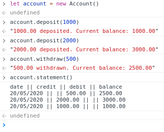
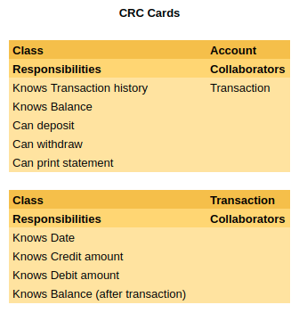

<!-- omit in toc -->
# Bank - Node

This is a small project to practice maintaining code quality and process. [Source]

I have previously created a Ruby implementation, [available here](https://github.com/hturnbull93/bank/).
I have also created a JavaScript implementation for the browser, [available here](https://github.com/hturnbull93/bank-js/).

It allows you to create an account, deposit funds into it, withdraw funds from it, and print statements.

- [Spec](#spec)
  - [Requirements](#requirements)
  - [Acceptance criteria](#acceptance-criteria)
- [Quick Start](#quick-start)
- [Dependencies](#dependencies)
- [Development Journal](#development-journal)
  - [Domain Modelling](#domain-modelling)
  - [User Stories](#user-stories)
  - [Set up](#set-up)
  - [Deposits](#deposits)
  - [Withdrawals](#withdrawals)
  - [Statement](#statement)

## Spec

### Requirements

- You should be able to interact with your code via a REPL like IRB or the JavaScript console. (You don't need to implement a command line interface that takes input from STDIN.)
- Deposits, withdrawal.
- Account statement (date, amount, balance) printing.
- Data can be kept in memory (it doesn't need to be stored to a database or anything).

### Acceptance criteria

**Given** a client makes a deposit of 1000 on 10-01-2012  
**And** a deposit of 2000 on 13-01-2012  
**And** a withdrawal of 500 on 14-01-2012  
**When** she prints her bank statement  
**Then** she would see:

```irb
date || credit || debit || balance
14/01/2012 || || 500.00 || 2500.00
13/01/2012 || 2000.00 || || 3000.00
10/01/2012 || 1000.00 || || 1000.00
```

## Quick Start

Coming soon.
<!--
1. Clone this repo.
2. Open `SpecRunner.html` in your browser.
3. Inspect the tests.
4. Open your browser console.
5. Set up your account with:

   ```js
   let account = new Account()
   ```

6. Use the account with the following methods:

| Method                     | Description                                                                                        |
| -------------------------- | -------------------------------------------------------------------------------------------------- |
| `account.deposit(number)`  | deposit however much you want into your account, this figure is in pounds with pence as decimals.  |
| `account.withdraw(number)` | withdraw however much you want from your account, this figure is in pounds with pence as decimals. |
| `account.statement()`      | prints a statement of all transactions so far                                                      |

You should see something similar to the below:

## Screen Preview


 -->

## Dependencies

Development:

[Mocha] - Testing runner framework.
[Chai] - Testing assertion/expectation library.
[Sinon] - Testing spy/stub/mock library.

## Development Journal

### Domain Modelling

Given that I know more about the final form of the program from the previous implementations, this project focusses more on the implementation rather than the planning steps. The below CRC modelling and User Stories are taken from the Ruby implementation.

CRC modelling:



### User Stories

- [x] 1

> As a Bank Manager,  
> So that we only take customers money,  
> I want accounts to start with balance 0

- [x] 2

> As a Customer,  
> So I can keep my money safe,  
> I want to be able to deposit into my account

- [x] 3

> As a Customer,  
> So I can spend my money,  
> I want to be able to withdraw from my account

- [x] 3.1

> As a Bank Manager,  
> So we don't go out of pocket,  
> I want withdrawals to only be allowed to occur if the customer has sufficient funds

- [ ] 4

> As a Customer,  
> So I can keep on top of my finances,  
> I want to be able to print my account statement

- [ ] 4.1

> As a Customer,  
> So I know when each transaction happened,  
> I want transactions on my statement to have the date

- [ ] 4.2

> As a Customer,  
> So I know how much each deposit was,  
> I want deposits on my statement to have the credit amount.

- [ ] 4.3

> As a Customer,  
> So I know how much each withdrawal was,  
> I want withdrawals on my statement to have the debit amount.

- [ ] 4.4

> As a Customer,  
> So can keep track of my balance,  
> I want transactions on my statement to have the balance amount after the transaction was completed.

- [ ] 4.5

> As a Customer,  
> Because more recent transactions are more important to me,  
> I want the statement transactions to be ordered from newest to oldest.

### Set up

Initialised node with `npm init`.

Installed Mocha with `npm install --save-dev mocha`.

Added `node_modules` to `.gitgnore`.

Added `test` dir for mocha.

Specified test script to run mocha.

Installed Chai with `npm install --save-dev chai`.

That's enough to get started.

### Deposits

- [x] 1

> As a Bank Manager,  
> So that we only take customers money,  
> I want accounts to start with balance 0

- [x] 2

> As a Customer,  
> So I can keep my money safe,  
> I want to be able to deposit into my account

In `test/accountTest.js` wrote a test for an `Account` class, with a `deposit` method taking 100 results in a string showing deposited 100 and balance of 100. Red.

In `src/account.js`:

- Added `Account` class.
- Added `deposit` function that returns the required string hardcoded.
- Export `Account` for require elsewhere.

Green.

Wrote test for `deposit` method taking 200 results in a string showing deposited 200.00 and balance of 200.00. Red.

- `deposit` now checks for the amount, then if it is 200, return the relevant "200.00" string, else return the "100.00" string.

Green.

Wrote test for `deposit` method taking 200 then 100 results in a string showing deposited 100.00 and balance of 300.00. Red.

- Added `constructor` to `Account` initialising `balance` with constant `STARTING_BALANCE` set as 0.
- `deposit` adds amount to balance, then interpolates the amount and new balance into a returned string.

Green.

Wrote test for `deposit` method taking 10.50, should in a string showing deposited 10.50 and balance of 10.50. Red.

The balance should probably be stored as pence, rather than as a float, but it needs to be display at two decimal places as if it were pounds and pence.

- Let `credit` in `deposit` be the amount passed multiplied by 100 (to get pence value).
- Added `credit` to the balance.
- Then interpolate credit and balance into the returned string converted to two decimal placed with parseFloat of the value / 100, toFixed 2 decimal places.

Green.

Refactors:

- Extracted the operations used to convert to two decimal places to a separate private helper method, `_asPounds`.
- Extracted the operation used to convert the amount to pence into a new private helper method, `_toPence`.

### Withdrawals

- [x] 3

> As a Customer,  
> So I can spend my money,  
> I want to be able to withdraw from my account

Wrote test for withdrawing 100 from an account with 1000, returned string has balance: 900.00. Red.

- Added `withdraw` method, hardcoded returned string.

Green.

Wrote test for withdrawing 200 from an account with 1000, returned string has balance: 800.00. Red.

- `withdraw` checks if the amount passed is 100, if so it returns the string, if not it returns a different string for withdrawing 200.

Wrote test for withdrawing 100 then 200 from an account with 1000, returned string has balance: 700.00. Red.

`withdraw` implements similar functionality to `deposit` but deducting the amount from the balance.

Green.

- [x] 3.1

> As a Bank Manager,  
> So we don't go out of pocket,  
> I want withdrawals to only be allowed to occur if the customer has sufficient funds

Wrote test for withdrawing 1500 from an account with 1000, string returned should say "Insufficient funds". Red.

- Added guard clause to check if the amount to be withdrawn is greater than the current balance, if so return the string.

Green.

### Statement

- [ ] 4

> As a Customer,  
> So I can keep on top of my finances,  
> I want to be able to print my account statement

The feature test I want to write needs to be able to have the date mocked. For this I will use [Sinon].

Sinon is installed with `npm install --save-dev sinon`

In `test/accountFeatureTest.js` wrote a feature test similar to the above acceptance criteria, using sinon fake timers to mock the date. Red.

<!-- Links -->

[source]: https://github.com/makersacademy/course/blob/master/individual_challenges/bank_tech_test.md
[Mocha]: https://mochajs.org/
[Chai]: https://www.chaijs.com/
[Sinon]: https://sinonjs.org/